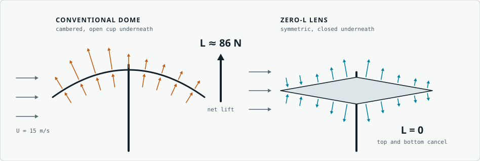
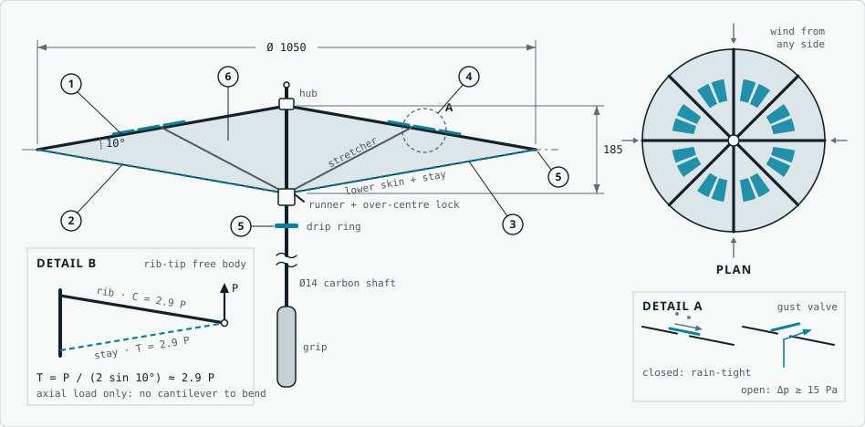
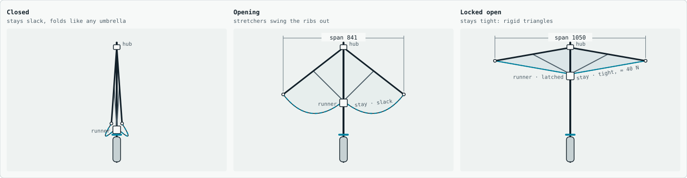
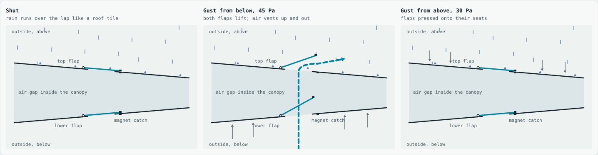
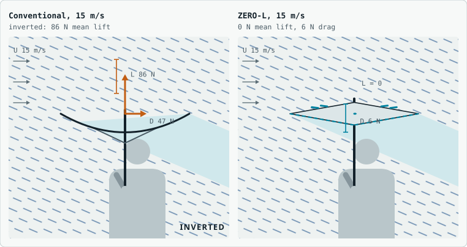
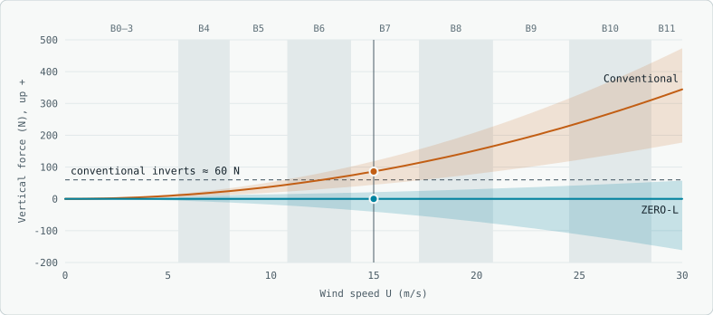

# ZERO-L: an umbrella that makes no lift

ZERO-L is a storm umbrella designed so the wind cannot lift it or turn it inside out, while it still covers you from rain and sun. It does not try to beat the wind with a stronger frame. It removes the reasons an umbrella makes lift in the first place.

**Status:** concept design with first-order calculations. Nothing here has been wind-tunnel tested yet; the [test plan](#test-plan) says how to change that.

**Interactive version:** download or clone this repository and open [`index.html`](index.html) in any browser. It runs offline and includes the drawings, a wind lab, the opening mechanism and the gust valves you can drive yourself.

<picture>
  <source media="(prefers-color-scheme: dark)" srcset="docs/dark/lift.svg">
  
</picture>

| At 15 m/s (Beaufort 7), ±10° gusts | Normal umbrella | ZERO-L |
|---|---|---|
| Mean lift, held level | 86 N up | **0 N** |
| Strongest upward pull in a gust | 118 N | **21 N** |
| Strongest downward push in a gust | none (44 N up at best) | 40 N |
| Drag, held level | 47 N | **6 N** |
| Turns inside out | from about 11 m/s in gusts | **cannot** |

Both umbrellas are 1.05 m across. The numbers come from the force model in [`model/zerol-model.js`](model/zerol-model.js).

## Why a normal umbrella lifts

1. **It is a cambered wing.** Cut through the shaft, a canopy is a thin, deeply curved arc. Thin-aerofoil theory puts its zero-lift angle at α<sub>L0</sub> ≈ −2f/c. With a 19 cm deep canopy on 105 cm (f/c ≈ 0.18) that is about −21°, so held level it already makes C<sub>L</sub> ≈ 0.7: 86 N of lift at 15 m/s.
2. **Its underside is an open cup.** Any upward gust blows straight into it and pressurises the canopy from below.
3. **Its rib tips are cantilevers.** The stretcher meets the rib at mid-span, so the outer half bends up under pressure from below until the shell snaps through.

## The design

<picture>
  <source media="(prefers-color-scheme: dark)" srcset="docs/dark/drawing.svg">
  
</picture>

1. **Symmetric double-wedge canopy.** Top and bottom skins are mirror images: 10° faces, 185 mm deep, a sharp rim. A section with no camber makes no lift when held level in level wind, from any compass direction, because the canopy is round.
2. **Closed lower skin.** There is no cup for a gust to fill and nothing that acts like a parachute.
3. **Tied-down rib tips.** A 2 mm Dyneema stay runs from each rib tip to the runner. Hub, tip and runner form a triangle, so the tip cannot rise without stretching the stay: T = P / (2 sin 10°) ≈ 2.9 P. Inversion is blocked by geometry, not resisted by stiffness.
4. **One-way gust valves.** 16 shingled flaps in each skin open when pressure from below passes 15 Pa. They clip upward gusts and stay shut against downward ones, so the umbrella can push into your hand but cannot pull out of it.
5. **Drip control.** The knife-edge rim sheds water cleanly; a drip ring on the shaft stops what runs down.
6. **Double-skin sun shield.** A reflective UPF 50+ top skin over a 185 mm air gap acts as a radiant barrier.

## How it works in the real world

### Opening and locking

<picture>
  <source media="(prefers-color-scheme: dark)" srcset="docs/dark/mechanism.svg">
  
</picture>

You open ZERO-L like any stick umbrella: push the runner 377 mm up the shaft and the stretchers swing the ribs out. The stays stay slack the whole way, so opening takes no extra effort. Only in the last few millimetres do they come tight and pull the lower skin into a cone. Then the over-centre latch clicks and holds about 40 N in every stay. From that moment each rib, its stay and the shaft form a rigid triangle. To close it, release the latch and slide the runner down; the stays go slack and it folds normally to about 80 cm.

### The gust valves

<picture>
  <source media="(prefers-color-scheme: dark)" srcset="docs/dark/valve.svg">
  
</picture>

Each valve is a pair: a flap on the top skin that opens outward and a flap on the lower skin that opens inward. Each flap is 80 × 115 mm of 0.25 mm PET film, hinged along its hub-side edge and held by a small magnet catch.

- **Rain, still air:** the flaps lie shut and lap over their slots like roof tiles, so water runs over them.
- **Gust from below:** above 15 Pa (0.14 N on a flap) both flaps lift. Air rushes up through the canopy and out sideways under the top flap, carrying spray outward, so the upward pull stops growing. At 45 Pa the air leaves the slot at about 4 m/s.
- **Gust from above:** the flaps are pressed onto their seats and seal tighter, so a downward gust cannot drive rain through.
- When the gust passes, the magnets and the flaps' own weight snap them shut in a fraction of a second.

### In the wind

<picture>
  <source media="(prefers-color-scheme: dark)" srcset="docs/dark/windlab.svg">
  
</picture>

<picture>
  <source media="(prefers-color-scheme: dark)" srcset="docs/dark/chart.svg">
  
</picture>

### A walk through a storm

1. **Open it.** The last centimetre feels firmer as the stays come tight, then the latch clicks.
2. **Light rain, still air.** It works like any umbrella; water leaves at the knife-edge rim, clear of your shoulders.
3. **The wind rises.** Keep it level. There is no steady lift to fight, and the sideways push is about 6 N at 15 m/s instead of 47 N.
4. **A gust from below.** The valves flick open and the tug stays small: about 21 N instead of 118 N. The tied rib tips cannot flip.
5. **A gust from above.** The valves stay shut and the canopy pushes down into your hand for a moment, up to about 40 N. It cannot be torn upward out of your grip.
6. **Rain starts driving sideways.** Tip it about 10° into the wind. That covers your head and shoulders and turns the force into a steady downward push.
7. **Strong sun.** The reflective top and the air gap keep the underside near air temperature. Hold it lower to shade your shoulders.
8. **Close it and dry it.** Dry it open; the valves let air through the gap between the skins.

## Build a prototype

The first working ZERO-L can be built on the frame of an ordinary 8-rib stick umbrella. The shaft, hub, runner and stretchers are reused; the ribs, skins, stays and valves are new.

| Part | Qty | Specification |
|---|---|---|
| Donor umbrella | 1 | 8-rib stick umbrella, about 105 cm. Supplies shaft, hub, runner, stretchers |
| Ribs | 8 | Carbon tube 7 mm OD / 5 mm ID, cut to 533 mm (donor fibreglass ribs are fine for a first mock-up) |
| Stays | 6 m | 2 mm single-braid Dyneema cord |
| Line-lock adjusters | 8 | For 2 mm cord; set each stay's length at the runner |
| Canopy fabric | 2.2 m² | 190T polyester pongee or 30D silnylon; top skin reflective and UV-coated |
| Valve flaps | 32 | 0.25 mm PET film, 80 × 115 mm |
| Magnet pairs | 32 | Small neodymium discs, releasing at about 0.14 N |
| Hinge and binding tape | 4 m | 15 mm nylon tape |
| Rib-tip caps | 8 | 3D-printed PETG or nylon: hold rib end, stay eye and both skin edges |
| Drip ring | 1 | Kayak-paddle drip ring or a large O-ring |
| Water repellent | 1 can | Fluorine-free spray |

1. **Strip the donor.** Keep the shaft, hub, runner, stretchers and their pins.
2. **Fit the ribs.** Pin the eight 533 mm tubes to the hub, and each stretcher to its rib 266 mm from the hub.
3. **Move the latch.** The runner must lock 185 mm below the hub. That sets the ribs at 10° below horizontal.
4. **Fit the tip caps.**
5. **Rig and tune the stays.** Tie each stay from tip cap to a line-lock on the runner. Latch the frame and tighten each stay until it rings at about 120 Hz when plucked (a phone tuner app reads this): f = (1/2L)·√(T/μ) with L = 0.533 m, T = 40 N, μ ≈ 2.5 g/m.
6. **Cut the skins.** Each skin is 8 flat gores: isosceles triangles with 533 mm sides, a 402 mm base and a 44.3° apex angle, plus 10 mm seam allowance. Laid flat, the 8 gores make 354.6° of a disc.
7. **Cut the valves.** Two 65 × 100 mm slots per gore, between 40% and 60% of the radius (16 per skin, 12% of the planform). Tape each flap along its hub-side edge and set a magnet pair at its free edge.
8. **Sew and close.** Top skin to sleeves on the ribs, lower skin to sleeves on the stays; bind both edges at the tip caps to make the knife-edge rim.
9. **Finish and check.** Fit the drip ring, spray both skins, and check that every flap lifts in the airflow of a hair dryer on low held underneath.

## Specification

| | |
|---|---|
| Canopy | 1050 mm diameter, planform 0.866 m² |
| Section | Symmetric double wedge, 10° faces, 185 mm deep (t/c 0.18), knife-edge rim |
| Ribs | 8 × carbon tube 7/5 mm, 533 mm |
| Stays | 8 × 2 mm Dyneema, about 3 kN breaking load, about 40 N pre-tension |
| Stretchers | 8 × 5 mm fibreglass, 297 mm |
| Gust valves | 16 top + 16 lower flaps, 12% of planform, opening at 15 Pa |
| Mass | about 600 g (estimate) |
| Closed length | about 80 cm |
| Design wind | controllable to 20 m/s (Beaufort 8); undamaged to 35 m/s (to be verified) |

## What it cannot do

- **Stop sideways rain.** At 15 m/s rain arrives 67° from vertical (2 mm drops fall at 6.5 m/s). No overhead canopy covers more than head and shoulders then. Tipping it into the rain buys cover but brings back lift. A louvered storm skirt that catches drops by inertia is the next add-on to test.
- **Ignore vertical gusts.** Air moving up or down through the canopy changes its angle of attack. ZERO-L's mean lift is zero and upward spikes are clipped, but downward pushes of about 40 N remain at 15 m/s with ±10° gusts. Two-way rain-proof valves (Dorade-box style) are phase 2.
- **Stay perfectly symmetric in use.** Your head under the canopy and wind shear near the ground leave a small residual lift that has to be measured.
- **Make a storm walkable.** Above Beaufort 9 (about 21 m/s) people struggle to stand. This is a storm umbrella, not a hurricane tool.

## Test plan

1. **Mock-up** from a donor umbrella, stays at about 40 N, no valves yet.
2. **Force balance** on a six-component balance or a car-roof rig at 5–25 m/s; sweep −30° to +30°. Pass: |C<sub>L</sub>| < 0.05 at 0°. The sharp rim fixes separation, so a 1:3 model at 30 m/s is acceptable.
3. **Valves:** measure the opening pressure and uplift curve. Target: upward pull ≤ 25 N at 15 m/s and +10°.
4. **Inversion attempt:** pitch to +45° at 25 m/s. Pass: no permanent deformation.
5. **Rain and sun:** 50 mm/h sprinkler rig with a fan; UPF test of the top skin (AS/NZS 4399); underside temperature in full sun.
6. **Field trial** with a handheld anemometer and a load cell in the grip.

## The force model

```
F = C·q·S        q = ½ρU²,  ρ = 1.225 kg/m³,  S = 0.866 m²
C_N = C_Lα·sin α_e·cos α_e + C_Dc·sin α_e·|sin α_e|      C_Lα = 1.83 /rad (Helmbold, A = 4/π)
C_L = C_N·cos α_e        C_D = C_D0 + C_N·sin α_e

Normal umbrella: α_e = α + 20.6°, C_Dc = 1.35 into the cup, 0.8 onto the dome, C_D0 = 0.12, |C_N| ≤ 1.45
ZERO-L:          α_e = α, C_Dc = 1.0, C_D0 = 0.05, |C_N| ≤ 1.3;
                 upward normal force above the 13 N valve load cut to 30 % (assumed)
```

Gust peaks are quasi-steady, which overstates very short gusts. The 60 N inversion load is an assumed typical value. Run it yourself with Node.js:

```bash
node model/zerol-model.js
node model/zerol-model.js 20 10 15
```

The arguments are wind speed in m/s, tilt into the wind in degrees and gust angle in ± degrees.

## Repository layout

| Path | What it is |
|---|---|
| `index.html` | The full interactive design note: drawings, real-world mechanism, gust valve, wind lab, build guide. Open it in a browser. |
| `model/zerol-model.js` | The force model as a Node.js script and module |
| `docs/light`, `docs/dark` | Figures used in this README, exported from `index.html` |
